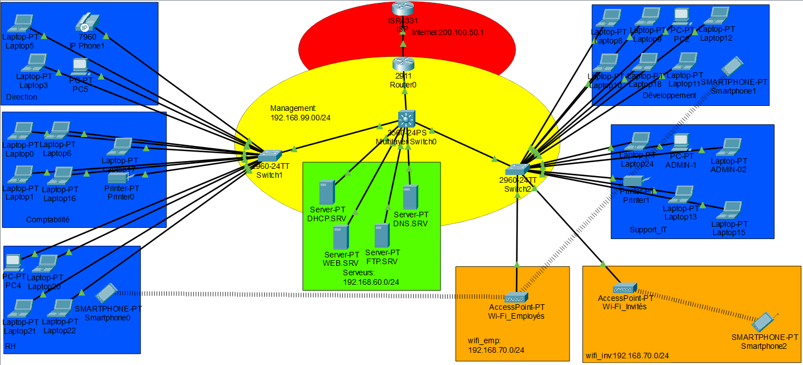

# KGTECH-Network
# KGTECH — Conception, déploiement et sécurisation d'un réseau d'entreprise segmenté

Projet de simulation réseau réalisé avec **Cisco Packet Tracer**, dans le cadre de ma formation en **Cybersécurité et Intelligence Artificielle (CSIA)** à l'ESATIC (Abidjan, Côte d'Ivoire).

L'objectif : concevoir, à partir d'une feuille blanche, l'infrastructure réseau complète d'une PME fictive — KangaTech Solutions — en jouant le rôle d'un ingénieur réseau chargé de l'architecture, du déploiement des services et de la sécurisation de l'ensemble.

---

## 📋 Contexte

**KangaTech Solutions** est une entreprise ivoirienne fictive spécialisée dans les services numériques, basée à Abidjan, comptant environ 80 employés répartis sur plusieurs services : Direction, Comptabilité, Ressources Humaines, Développement informatique, Support IT, Accueil, Salle serveur, ainsi qu'un réseau Wi-Fi invités.

L'entreprise a exprimé un besoin clair : un accès Internet, des services numériques internes (DHCP, DNS, Web, FTP), une administration distante sécurisée, un Wi-Fi invités isolé du reste du réseau — le tout avec une séparation stricte des services et une politique de sécurité cohérente, sans sacrifier la capacité du réseau à évoluer.

## 🎯 Objectifs du projet

- Concevoir une architecture réseau segmentée par VLAN, cohérente avec l'organisation de l'entreprise
- Fournir un accès Internet à l'ensemble des services (NAT/PAT)
- Déployer les services essentiels : DHCP, DNS, serveur Web interne, FTP
- Sécuriser l'administration distante des équipements (SSH)
- Séparer le Wi-Fi Employés du Wi-Fi Invités, avec isolation de ce dernier
- Mettre en œuvre une politique de sécurité réseau en profondeur (ACL, Port Security, DHCP Snooping)
- Garder une architecture capable d'absorber la croissance de l'entreprise

## 🏗️ Architecture réseau

Le réseau est organisé en trois niveaux :

- **Accès Internet simulé** — `RouterISP`, avec une interface loopback jouant le rôle d'un hôte public
- **Routeur de bordure** — `Router-Edge`, qui assure le NAT/PAT dynamique
- **Cœur de réseau** — `Sw-core`, un switch multicouche qui centralise tout le routage inter-VLAN, relié à deux switchs d'accès (`SW-ACC1`, `SW-ACC2`) qui raccordent postes de travail, serveurs et points d'accès Wi-Fi



## 🌐 Plan d'adressage et VLANs

| VLAN | Nom | Réseau | Passerelle |
|------|-----|--------|------------|
| 10 | Direction | 192.168.10.0/24 | 192.168.10.1 |
| 20 | Comptabilité | 192.168.20.0/24 | 192.168.20.1 |
| 30 | RH | 192.168.30.0/24 | 192.168.30.1 |
| 40 | Développement | 192.168.40.0/24 | 192.168.40.1 |
| 50 | Support IT | 192.168.50.0/24 | 192.168.50.1 |
| 60 | Salle Serveurs | 192.168.60.0/24 | 192.168.60.1 |
| 70 | Wi-Fi Employés | 192.168.70.0/24 | 192.168.70.1 |
| 80 | Wi-Fi Invités | 192.168.80.0/24 | 192.168.80.1 |
| 99 | Management | 192.168.99.0/24 | 192.168.99.1 |
| 999 | Réserve (ports inutilisés) | — | — |

Le détail complet du plan d'adressage (serveurs, liens de transit) est disponible dans la documentation.

## 🛠️ Services déployés

| Service | Détail |
|---|---|
| **DHCP** | Serveur centralisé, un pool par VLAN, relayé via `ip helper-address` |
| **DNS** | Résolution de noms internes (domaine `kgtech.local`) |
| **Web** | Portail interne de présentation de l'entreprise |
| **FTP** | Partage de fichiers, accès restreint aux postes d'administration |
| **Wi-Fi** | Deux SSID distincts (WPA2-PSK) : Employés et Invités, chacun sur son VLAN |
| **Internet** | NAT/PAT dynamique (overload) via Router-Edge |

## 🔒 Sécurité mise en œuvre

- **ACL par VLAN** — chaque VLAN métier n'a accès qu'aux services strictement nécessaires (DNS, Web, parfois FTP) ; le reste du réseau interne lui est fermé par défaut (principe du moindre privilège)
- **Isolation du Wi-Fi Invités** — aucun accès aux ressources internes, uniquement Internet
- **SSH restreint** — authentification locale, clés RSA 2048 bits, accès en ligne de commande limité par ACL à deux postes d'administration dédiés (VLAN Support IT)
- **Port Security** — adresses MAC apprises automatiquement (sticky), mode `Restrict`, appliqué uniquement sur les ports terminaux (postes, serveurs) — volontairement absent sur les trunks et les ports reliés aux points d'accès Wi-Fi
- **DHCP Snooping** — ports de confiance limités au serveur DHCP et aux liaisons trunk, protection contre les faux serveurs DHCP et le DHCP Starvation
- **VTP en mode Transparent** — élimine le risque de propagation d'une base VLAN corrompue entre switchs
- **Ports inutilisés désactivés** — regroupés dans un VLAN de réserve (999) et coupés (`shutdown`)
- **Trunks fixés explicitement** (`switchport mode trunk` en dur, pas en négociation automatique) pour éviter toute instabilité de lien

## ✅ Tests réalisés

- Connectivité intra-VLAN et inter-VLAN (autorisée / bloquée selon les ACL)
- Attribution DHCP sur l'ensemble des VLANs
- Résolution DNS et accès au portail Web interne
- Accès FTP autorisé pour les postes admin, refusé pour les autres
- Accès Internet (NAT) validé via ping vers l'IP publique simulée
- Isolation effective du Wi-Fi Invités
- Restriction SSH testée depuis un poste autorisé et un poste non autorisé
- Détection de violation Port Security (changement d'adresse MAC)

Le détail des procédures et résultats est disponible dans la documentation complète.

## 🧩 Difficultés rencontrées

Ce projet n'a pas été qu'une suite de configurations qui fonctionnent du premier coup — il a nécessité un vrai travail de diagnostic sur des incidents réels : ordre d'évaluation des ACL Cisco, conflits d'adressage IP entre sous-interfaces, instabilité de liaisons trunk en négociation automatique, port security appliqué par erreur sur un lien trunk, risque de propagation VTP entre switchs. Chaque incident, sa cause et sa résolution sont détaillés dans la section 11 de la documentation.

## 📁 Structure du dépôt

```
KGTECH-Network/
│
├── PacketTracer/         → Fichier .pkt de la simulation complète
├── Documentation/        → Documentation projet complète (PDF)
├── Screenshots/          → Captures d'écran (topologie, tests, configurations)
├── Configurations/       → Running-config de chaque équipement (.txt)
└── README.md
```

## 📄 Documentation complète

La documentation détaillée (contexte, analyse des besoins, architecture, plan d'adressage, configuration des équipements, politique de sécurité, tests, difficultés rencontrées et solutions) est disponible ici :
👉 [Documentation/KGTECH_Documentation.pdf](./Documentation/KGTECH_Documentation.pdf)

## 💡 Compétences démontrées

`VLAN & Trunking` `Routage inter-VLAN` `ACL Cisco` `NAT / PAT` `DHCP & DNS` `SSH` `Port Security` `DHCP Snooping` `VTP` `Diagnostic et dépannage réseau` `Documentation technique`

## 👤 Auteur

**Kanga Yao Yoann Samuel**
Étudiant en Licence — Cybersécurité et Intelligence Artificielle (CSIA)
ESATIC — École Supérieure Africaine des TIC, Abidjan
